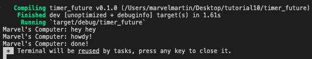

# Tutorial 10 - timer
AdvPro B - Marvel Martin Everthard - 2206081345

## 1.2. Understanding how it works

Dari gambar di atas, dapat terlihat bahwa pesan **"Marvel's Computer: hey hey**" dicetak terlebih dahulu daripada **"Marvel's Computer: howdy!"** dan **"Marvel's Computer: done!"**. Hal ini dikarenakan print statement `println!("Marvel's Computer: hey hey");` pada `src/main.rs` tidak berada di dalam _asynchronous_ task, melainkan berada di dalam main function yang akan dijalankan dalam main thread. Sedangkan, print statement untuk pesan **"Marvel's Computer: howdy!"** dan **"Marvel's Computer: done!"** berada pada _asynchronous_ task yang akan dijalankan ketika eksekutor di-_run_.
