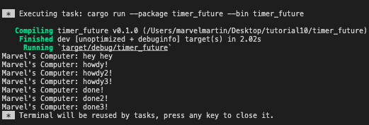
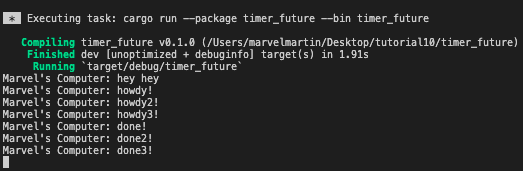
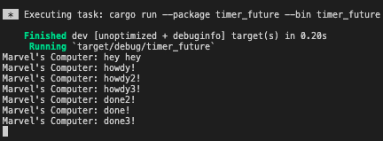

# Tutorial 10 - timer
AdvPro B - Marvel Martin Everthard - 2206081345

## 1.2. Understanding how it works

Dari gambar di atas, dapat terlihat bahwa pesan **"Marvel's Computer: hey hey**" dicetak terlebih dahulu daripada **"Marvel's Computer: howdy!"** dan **"Marvel's Computer: done!"**. Hal ini dikarenakan print statement `println!("Marvel's Computer: hey hey");` pada `src/main.rs` tidak berada di dalam _asynchronous_ task, melainkan berada di dalam main function yang akan dijalankan dalam main thread. Sedangkan, print statement untuk pesan **"Marvel's Computer: howdy!"** dan **"Marvel's Computer: done!"** berada pada _asynchronous_ task yang akan dijalankan ketika eksekutor di-_run_.

## 1.3.  Multiple Spawn and removing drop

- **_Tanpa menghilangkan_** `drop(spawner);`

- **_Dengan menghilangkan_** `drop(spawner);`
 

Dari ketiga gambar di atas, dapat terlihat bahwa programnya tidak berhenti ketika perintah `drop(spawner);` di-_remove_. Hal ini dikarenakan tidak ada penanda ke eksekutor bahwa tidak ada lagi task yang akan di-_spawn_ yang menyebabkan eksekutor tidak dapat membersihkan resources karena tasknya dianggap belom selesai. Selain itu, terlihat juga bahwa terdapat perbedaan urutan pesan yang tercetak tiap kali program dijalankan. Hal ini dikarenakan terdapat tiga asynchronous task pada spawner yang berbeda yang dieksekusi sceara bersamaan oleh eksekutor sehingga urutannya dapat bervariasi tergantung pada bagaimana eksekutor menangani tugas-tugas tersebut.